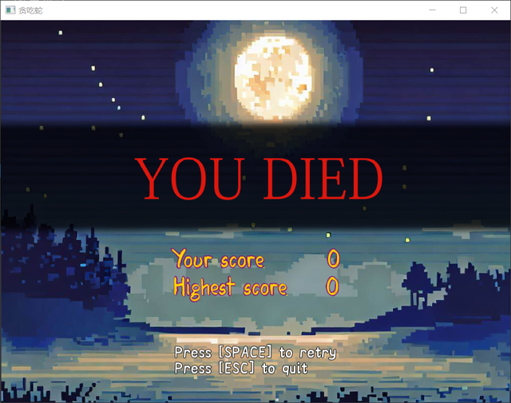

sfSnake： FDU OOP Final Project 2023
=====

#### Tasks
Implement the basic Snake game, and add the following features:

1) Mouse control
2) Fruit random generation
3) Sprite-based version of the snake
4) Overall interface redesign
5) Other modifications

#### Environments
* Windows 10
* SFML2.5
* cmake 3.25.2
* g++ (MinGW-W64) 13.0.1

#### Results
 
* Menu Page

* Config Page

  

* Map & Snake

##### Reactions (to different fruits):

* Gameover Page

* Hard Mode:

* Score Record:

